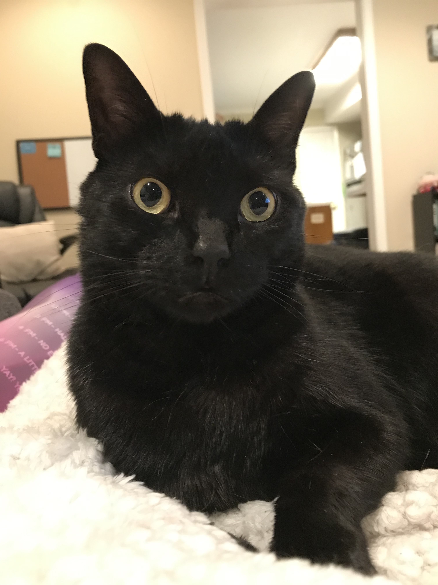
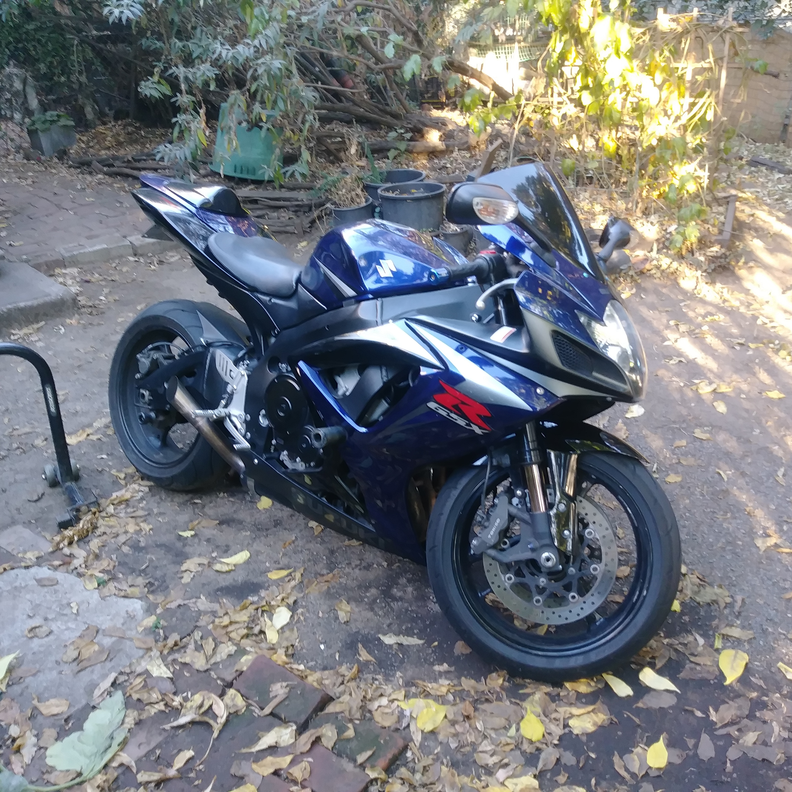
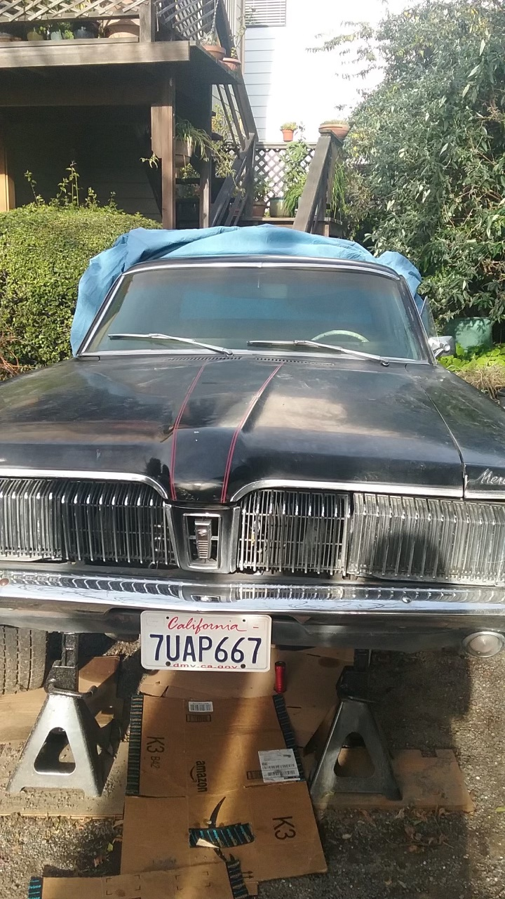

## This is Louis' Website

Welcome to my website!

Hi! My name is Louis Sharp, I'm from Oakland, CA and I am in the MS in Biostatistics program at Columbia University in New York, studying Public Health Data Science! I did my Bachelor's studies at University of California, Berkeley in Molecular and Cell Biology. Some of my interests include science (biological and otherwise), kitties, motorcycles, old cars, and cooking. Here's some pictures!

This is Shadow! He's my sister's cat, and he's a bit of a strange guy, but he's my buddy and he's been keeping me going during my first semester in grad school.

{width=33%}{width=33%}{width=33%}

These are some of motorcycles I owned and loved riding back in California, before I moved to New York. I ended up taking the blue one entirely apart piece by piece for reasons! The silver one was ol' trusty and never let me down. I miss those bikes and riding in general since I left home. 

{width=75%}

Here's an old car I used to own and work on alot, it's a 1967 Mercury Cougar. I sold it to my buddy when I got into motorcycles about 5 years ago.. I still regret it! He's taking good care of it though. $\\$
Fun fact about my house in those motorcycle/car pictures, it appeared in the movie Blindspotting! If you've seen the movie, see if you can spot the house by the paint/trim color (I know it's a challenge, as there's not much to work with). $\\$
For my science and research interests, please see my about page! Thanks for visiting.